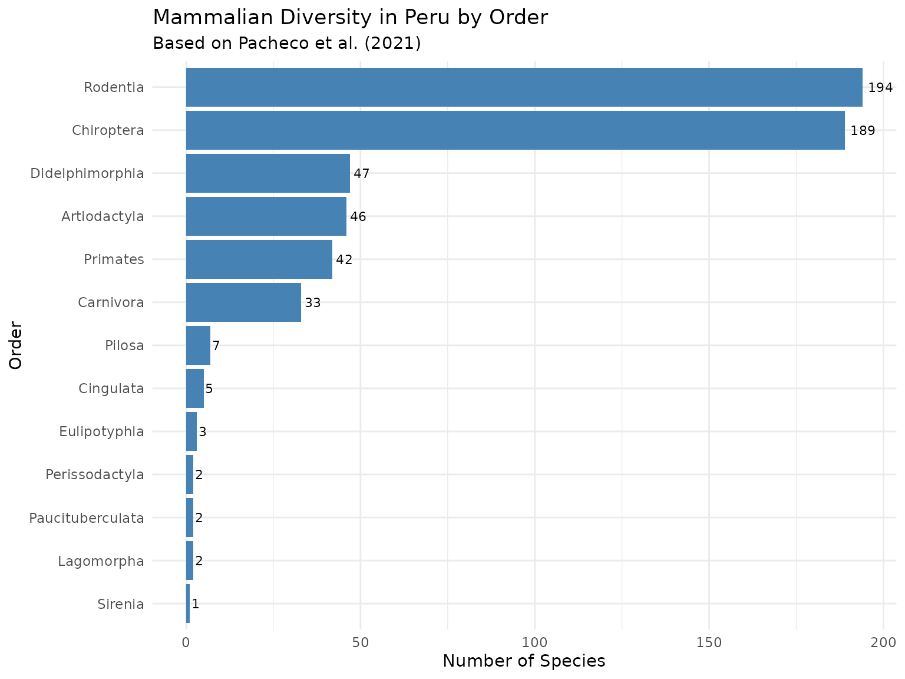

# Exploring Mammal Diversity in Peru with perumammals

## Introduction

Peru is widely recognized as one of the world’s megadiverse countries,
ranking second in the Neotropics and the Americas for mammalian
diversity, with **573 species** across 13 orders (Pacheco et al., 2021).
The `perumammals` package provides direct access to this updated
taxonomic dataset, enabling researchers, students, and conservation
practitioners to explore, validate, and analyze mammals occurring in
Peru.

### Dataset Background

The updated mammalian checklist by Pacheco et al. (2021) compiles:

- **573 species**, **223 genera**, **51 families**, **13 orders**
- **87 endemic species** (15.2% of total)
- Presence across 9 ecoregions, from coastal deserts to Amazonian
  rainforests
- Continuous updates reflecting recent systematic revisions

The package adopts this taxonomic framework and includes tools for
validating species names and handling synonyms or misspelled entries via
fuzzy matching.

## Loading the Dataset

``` r
data("peru_mammals")

glimpse(peru_mammals)
#> Rows: 573
#> Columns: 12
#> $ pm_id                <chr> "M0542_EUB", "M0543_BAL", "M0544_BAL", "M0545_BAL…
#> $ order                <chr> "Artiodactyla", "Artiodactyla", "Artiodactyla", "…
#> $ family               <chr> "Balaenidae", "Balaenopteridae", "Balaenopteridae…
#> $ genus                <chr> "Eubalaena", "Balaenoptera", "Balaenoptera", "Bal…
#> $ species              <chr> "australis", "bonaerensis", "borealis", "edeni", …
#> $ scientific_name      <chr> "Eubalaena australis", "Balaenoptera bonaerensis"…
#> $ scientific_name_full <chr> "Eubalaena australis (Desmoulins, 1822)", "Balaen…
#> $ author               <chr> "(Desmoulins, 1822)", "Burmeister, 1867", "Lesson…
#> $ common_name          <chr> "Ballena franca del sur", "Ballena minke austral"…
#> $ endemic              <lgl> FALSE, FALSE, FALSE, FALSE, FALSE, FALSE, FALSE, …
#> $ ecoregions           <chr> "OCE", "OCE", "OCE", "OCE", "OCE", "OCE", "OCE", …
#> $ reference            <chr> "Reyes 2009", "Reyes 2009", "Jefferson et al. 199…
```

## Taxonomic Diversity

### Orders and Species Richness

``` r
order_summary <- peru_mammals %>%
  count(order, sort = TRUE) %>%
  mutate(percentage = round(n / sum(n) * 100, 1))

order_summary
#> # A tibble: 13 × 3
#>    order                n percentage
#>    <chr>            <int>      <dbl>
#>  1 Rodentia           194       33.9
#>  2 Chiroptera         189       33  
#>  3 Didelphimorphia     47        8.2
#>  4 Artiodactyla        46        8  
#>  5 Primates            42        7.3
#>  6 Carnivora           33        5.8
#>  7 Pilosa               7        1.2
#>  8 Cingulata            5        0.9
#>  9 Eulipotyphla         3        0.5
#> 10 Lagomorpha           2        0.3
#> 11 Paucituberculata     2        0.3
#> 12 Perissodactyla       2        0.3
#> 13 Sirenia              1        0.2

ggplot(order_summary, aes(x = reorder(order, n), y = n)) +
  geom_col(fill = "steelblue") +
  geom_text(aes(label = n), hjust = -0.2, size = 3) +
  coord_flip() +
  labs(
    title = "Mammalian Diversity in Peru by Order",
    subtitle = "Based on Pacheco et al. (2021)",
    x = "Order",
    y = "Number of Species"
  ) +
  theme_minimal()
```



**Rodentia** (194 species) and **Chiroptera** (189 species) together
account for nearly **67%** of Peru’s mammalian diversity.

## Endemic Species

``` r
endemic_summary <- peru_mammals %>%
  filter(endemic == TRUE) %>%
  count(order, sort = TRUE)

endemic_summary
#> # A tibble: 6 × 2
#>   order               n
#>   <chr>           <int>
#> 1 Rodentia           56
#> 2 Didelphimorphia    10
#> 3 Chiroptera          9
#> 4 Primates            9
#> 5 Eulipotyphla        2
#> 6 Cingulata           1

endemism_rate <- peru_mammals %>%
  group_by(order) %>%
  summarise(
    total = n(),
    endemic = sum(endemic == TRUE),
    endemic_pct = round(endemic / total * 100, 1)
  ) %>%
  filter(endemic > 0) %>%
  arrange(desc(endemic_pct))

endemism_rate
#> # A tibble: 6 × 4
#>   order           total endemic endemic_pct
#>   <chr>           <int>   <int>       <dbl>
#> 1 Eulipotyphla        3       2        66.7
#> 2 Rodentia          194      56        28.9
#> 3 Primates           42       9        21.4
#> 4 Didelphimorphia    47      10        21.3
#> 5 Cingulata           5       1        20  
#> 6 Chiroptera        189       9         4.8
```

**Rodentia** contains the largest number of endemic species (56),
representing **64.4%** of all mammalian endemics in Peru.

## Geographic Distribution

### Ecoregional Diversity

``` r

ecoregion_diversity <- tribble(
  ~ecoregion, ~species, ~endemics,
  "Selva Baja", 320, 18,
  "Yungas", 256, 48,
  "Sabana de Palmeras", 78, 0,
  "Puna", 71, 14,
  "Vertiente Occidental", 71, 15,
  "Bosque Seco Ecuatorial", 81, 4,
  "Bosque Pluvial Pacífico", 69, 0,
  "Costa", 66, 16,
  "Oceánica", 30, 0,
  "Páramo", 26, 4
) |>
  mutate(
    has_endemics = endemics > 0,
    ecoregion = factor(ecoregion, levels = ecoregion[order(species)])
  )

# Gráfico
library(ggplot2)
ggplot(ecoregion_diversity, aes(x = ecoregion, y = species)) +
  geom_col(aes(fill = has_endemics), width = 0.8) +
  geom_text(aes(label = species), hjust = -0.15, size = 3.4) +
  coord_flip(clip = "off") +
  scale_fill_manual(
    values = c("FALSE" = "#5A7BAA", "TRUE" = "#E07A5F"),
    labels = c("No endemics", "Has endemics"),
    name = ""
  ) +
  labs(
  title = "Mammal Diversity by Ecoregion of Peru",
  subtitle = "Colors indicate the presence or absence of endemic species",
  x = "Ecoregion",
  y = "Number of Species"
  ) +
  theme_minimal(base_size = 12) +
  theme(
    plot.title = element_text(face = "bold", size = 14),
    plot.subtitle = element_text(size = 11),
    axis.text.y = element_text(size = 10),
    legend.position = "top",
    plot.margin = margin(10, 30, 10, 10)
  )
```


The **Selva Baja** contains the highest species richness, while the
**Yungas** harbor the greatest number of endemic mammals.

## Name Validation and Fuzzy Matching

``` r
species_list <- c(
  "Tremarctos ornatos",
  "Leopardus pardalis",
  "Odocoileus virginanus",
  "Lagothrix flavicauda",
  "Alouatta seniculus",
  "Puma concolor"
)

validated <- validate_peru_mammals(
  species_list,
  quiet = FALSE
)
#> Loaded peru_mammals database: 573 species
#> Classified 6 input names
#>   Rank 1 (genus): 0
#>   Rank 2 (binomial): 6
#> 
#> Starting hierarchical matching pipeline...
#> Node 1 (Direct match): 4 matches
#> Node 2 (Genus match): 2 matches
#> Node 4 (Fuzzy species): 1 matches
#> ── MATCHING SUMMARY ────────────────────────────────────────────────────────────
#> 
#> ── Statistics ──
#> 
#> • Input names: 6
#> • Matched names: 5 (83.3%)
#> • Direct matches: 4
#> • Unmatched names: 1
#> ! Fuzzy matching was used. Review results carefully.
#> ℹ Use `get_ambiguous_matches()` to check for ambiguous cases.
#> ────────────────────────────────────────────────────────────────────────────────

validated %>%
  select(Orig.Name, Matched.Name, Match.Level, valid_rank)
#>               Orig.Name         Matched.Name            Match.Level valid_rank
#> 1    Tremarctos ornatos   Tremarctos ornatus             Exact rank       TRUE
#> 2    Leopardus pardalis   Leopardus pardalis             Exact rank       TRUE
#> 3 Odocoileus virginanus           Odocoileus Matched at higher rank      FALSE
#> 4  Lagothrix flavicauda Lagothrix flavicauda             Exact rank       TRUE
#> 5    Alouatta seniculus   Alouatta seniculus             Exact rank       TRUE
#> 6         Puma concolor        Puma concolor             Exact rank       TRUE
```

The fuzzy matching tool corrects common misspellings and returns
standardized scientific names while preserving the original input.

## Practical Applications

### Conservation Assessment

``` r
endemic_primates <- peru_mammals %>%
  filter(order == "Primates", endemic == TRUE) %>%
  select(genus, species, common_name)

endemic_primates
#> # A tibble: 9 × 3
#>   genus      species       common_name                                
#>   <chr>      <chr>         <chr>                                      
#> 1 Lagothrix  flavicauda    Mono choro de cola amarilla                
#> 2 Aotus      miconax       Mono nocturno peruano, mono nocturno andino
#> 3 Saguinus   illigeri      Pichico pardo de Illiger                   
#> 4 Saguinus   leucogenys    Pichico andino                             
#> 5 Saguinus   nigrifrons    Pichico de frente negra                    
#> 6 Callicebus oenanthe      Tocón del río Mayo                         
#> 7 Callicebus urubambensis  Tocón del Urubamba                         
#> 8 Pithecia   aequatorialis Huapo ecuatorial                           
#> 9 Pithecia   isabela       Huapo de Isabel
```

### Research Data Cleaning

``` r
field_data <- data.frame(
  site = rep(c("Site_A", "Site_B", "Site_C"), each = 3),
  species = c(
    "Tremarctos ornatos", "Mazama rufina", "Odocoileus virginianus",
    "Leopardus pardalis", "Puma concolor", "Leopardus jacobita",
    "Lagothrix flavicauda", "Ateles belzebuth", "Alouatta seniculus"
  ),
  count = c(2, 1, 3, 1, 2, 1, 5, 3, 2)
)

cleaned_data <- field_data %>%
  left_join(
    validate_peru_mammals(field_data$species),
    by = c("species" = "Orig.Name")
  ) %>%
  select(site, original = species, validated = Matched.Name, count, Match.Level)

cleaned_data
#>     site               original            validated count
#> 1 Site_A     Tremarctos ornatos   Tremarctos ornatus     2
#> 2 Site_A          Mazama rufina        Mazama rufina     1
#> 3 Site_A Odocoileus virginianus           Odocoileus     3
#> 4 Site_B     Leopardus pardalis   Leopardus pardalis     1
#> 5 Site_B          Puma concolor        Puma concolor     2
#> 6 Site_B     Leopardus jacobita   Leopardus jacobita     1
#> 7 Site_C   Lagothrix flavicauda Lagothrix flavicauda     5
#> 8 Site_C       Ateles belzebuth     Ateles belzebuth     3
#> 9 Site_C     Alouatta seniculus   Alouatta seniculus     2
#>              Match.Level
#> 1             Exact rank
#> 2             Exact rank
#> 3 Matched at higher rank
#> 4             Exact rank
#> 5             Exact rank
#> 6             Exact rank
#> 7             Exact rank
#> 8             Exact rank
#> 9             Exact rank
```

## Citation

### Package Citation

``` r
citation("perumammals")
#> To cite perumammals in publications, please use:
#> 
#>   Santos Andrade, P. E. (2025). perumammals: Taxonomic Backbone and
#>   Name Validation Tools for Mammals of Peru. R package version 0.0.0.1.
#>   Available at https://paulesantos.github.io/perumammals/.
#> 
#>   Pacheco, V., Cadenillas, R., Zeballos, H., Hurtado, C. M., Ruelas,
#>   D., & Pari, A. (2021). Lista actualizada de la diversidad de los
#>   mamíferos del Perú y una propuesta para su actualización. Revista
#>   peruana de biología.
#> 
#> The taxonomic backbone included in this package is based on the
#> following reference:
#> 
#> To see these entries in BibTeX format, use 'print(<citation>,
#> bibtex=TRUE)', 'toBibtex(.)', or set
#> 'options(citation.bibtex.max=999)'.
```

------------------------------------------------------------------------
